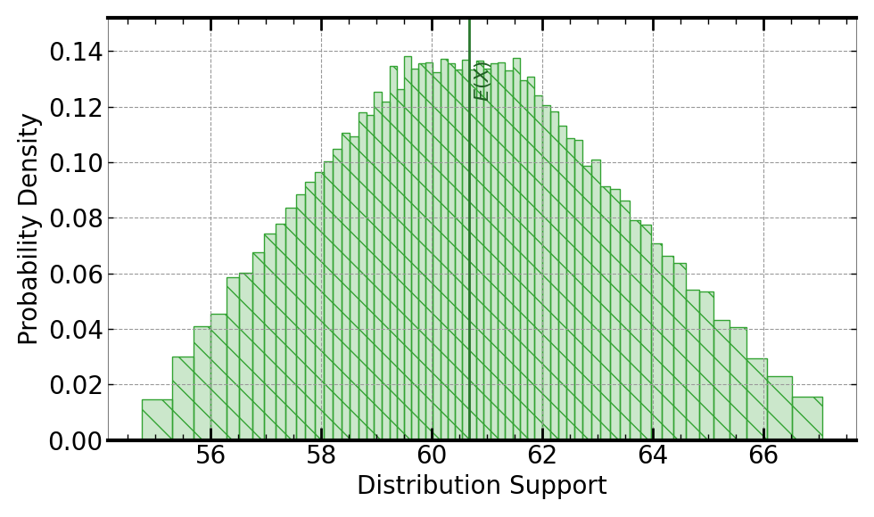

[](https://signaloid.io/repositories?connect=https://github.com/signaloid/Signaloid-Demo-Sensors-NXPMPX4100AConversionRoutines#gh-dark-mode-only)
[](https://signaloid.io/repositories?connect=https://github.com/signaloid/Signaloid-Demo-Sensors-NXPMPX4100AConversionRoutines#gh-light-mode-only)

# NXP MPX4100A Sensor Calibration Use Case
Example demonstrating output uncertainty estimation for calibrated ADC values from the MPX4100A sensor[^1].

## Introduction
The MPX4100A is a 20 to 250 kPa range integrated pressure sensor.

## Getting started

The correct way to clone this repository to get the submodules is:
```sh
	git clone --recursive git@github.com:signaloid/Signaloid-Demo-Sensors-NXPMPX4100AConversionRoutines.git
```

If you forgot to clone with `--recursive` and end up with empty submodule directories, you can remedy this with:
```sh
	git submodule update --init
```

## Running the application locally
Apart from using Signaloid's Cloud Compute Platform, you can compile and run this application
locally. Local execution is essentially a native Monte Carlo implementation,
that uses GNU Scientific Library (GSL)[^2] to generate samples for the different input distributions.
In this mode the application stores the generated output samples, in a file called `data.out`.
The first line of `data.out` contains the execution time of the Monte Carlo implementation
in microseconds (μs), and each
next line contains a floating-point value corresponding to an output sample value.
Please note, that for the Monte Carlo output mode, you need to select a single output
to calculate, using (`-S`) command-line option.

In order to compile and run this application in the native Monte Carlo mode:

0. Install dependencies (e.g., on Linux):
```
sudo apt-get install libgsl-dev libgslcblas0
```
1. Compile natively (e.g., on Linux):
```
cd src/
gcc -I. -I/opt/local/include main.c utilities.c common.c uxhw.c -L/opt/local/lib -o native-exe -lgsl -lgslcblas -lm
```
2. Run the application in the MonteCarlo mode, using (`-M`) command-line option:
```
./native-exe -M 10000
```
The above program runs 10000 Monte Carlo iterations.

3. See the output samples generated by the local Monte Carlo execution:
```
cat data.out
```

## Inputs
The inputs to the NXPMPX4100A sensor conversion algorithms are the raw ADC taken from the voltage output of the sensor ($V_{out}$)
as well as the supply voltage of the sensor ($V_{s}$). The algorithm models the ADC quantization error as well as the uncertainty
in the supply voltage using uniform distributions.

The uncertainty in $V_{out}$ is modeled as a (`UniformDist(2.3, 2.7)`) Volts.

The uncertainty in $V_{s}$ is modeled as a (`UniformDist(4.8, 5.4)`) Volts.

## Outputs
The output of the application is the calibrated pressure, calculated by:
```math
\mathrm{Calibrated Sensor Output} = \frac{(V_{out}/V_{s} + 0.1518)}{0.01059}
```
Following is an example output, using Signaloid's C0Pro-S core:



## Usage
```
Example: NXPMPX4100A sensor conversion routines - Signaloid version

Usage: Valid command-line arguments are:
        [-o, --output <Path to output CSV file : str>] (Specify the output file.)
        [-S, --select-output <output : int>] (Compute 0-indexed output, by default 0.)
        [-M, --multiple-executions <Number of executions : int (Default: 1)>] (Repeated execute kernel for benchmarking.)
        [-T, --time] (Timing mode: Times and prints the timing of the kernel execution.)
        [-b, --benchmarking] (Benchmarking mode: Generate outputs in format for benchmarking.)
        [-j, --json] (Print output in JSON format.)
        [-h, --help] (Display this help message.)
```


---

[^1]: [20 to 250 kPa, Absolute, Integrated Pressure Sensor Datasheet](https://www.nxp.com/docs/en/data-sheet/MPX4100A.pdf).

[^2]: [GNU Scientific Library](https://www.gnu.org/software/gsl/)

